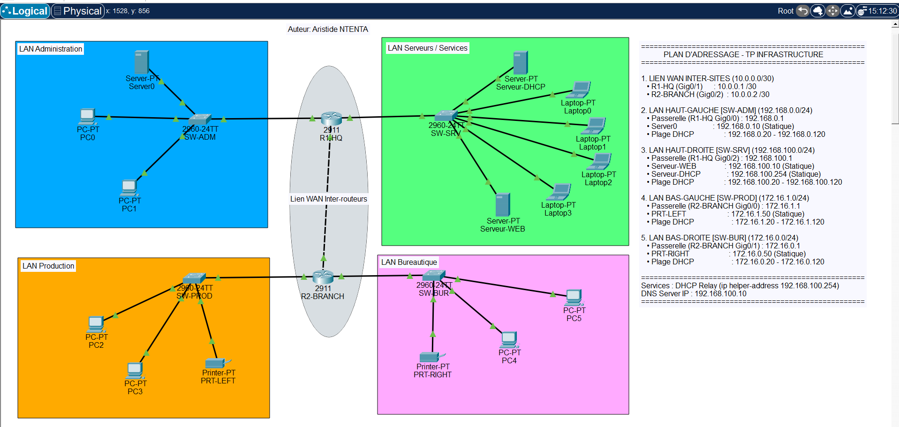

# cisco-multisite-dhcp-relay-lab
Infrastructure réseau multi-sites sous Cisco Packet Tracer (Routage statique, Relais DHCP, Segmentation VLSM)
# 🌐 Entreprise Multi-Site Network Architecture Lab



## 📌 Vue d'ensemble
Conception et déploiement sous **Cisco Packet Tracer** d'une infrastructure réseau d'entreprise interconnectant un siège social (**HQ**) et une succursale (**Branch**).

Le projet met en œuvre un découpage réseau strict en masques `/24`, du routage statique inter-sites, ainsi que la centralisation du service DHCP via un relais d'agents (`ip helper-address`).

---

## 📐 Architecture & Plan d'Adressage

| Zone / Réseau | Masque | Passerelle | Attribution / Plage DHCP | Rôle & Hôtes |
| :--- | :--- | :--- | :--- | :--- |
| **Lien WAN** (`10.0.0.0/30`) | `255.255.255.252` | N/A | Inter-routeurs | `R1-HQ` (`.1`) <-> `R2-BRANCH` (`.2`) |
| **LAN ADM** (`192.168.0.0/24`) | `255.255.255.0` | `192.168.0.1` | `192.168.0.20 - .120` | SW-ADM, Server0 (`.10`), PC0, PC1 |
| **LAN SRV** (`192.168.100.0/24`) | `255.255.255.0` | `192.168.100.1` | `192.168.100.20 - .120` | SW-SRV, Web (`.10`), DHCP (`.254`), Laptops |
| **LAN PROD** (`172.16.1.0/24`) | `255.255.255.0` | `172.16.1.1` | `172.16.1.20 - .120` | SW-PROD, PRT-LEFT (`.50`), PC2, PC3 |
| **LAN BUR** (`172.16.0.0/24`) | `255.255.255.0` | `172.16.0.1` | `172.16.0.20 - .120` | SW-BUR, PRT-RIGHT (`.50`), PC4, PC5 |

---

## ⚙️ Spécifications Techniques & Configurations

### 1. Routage Statique Inter-sites
Acheminement des flux entre les deux routeurs Cisco 2911 :
* **R1-HQ :** Déclaration des routes vers les sous-réseaux distants (`172.16.1.0/24` et `172.16.0.0/24`) via l'interface `10.0.0.2`.
* **R2-BRANCH :** Route par défaut ou routes spécifiques vers les réseaux du siège (`192.168.0.0/24` et `192.168.100.0/24`) via `10.0.0.1`.

### 2. Centralisation du Service DHCP
Configuration d'un serveur unique (`192.168.100.254`) fournissant les baux IP pour les 4 LANs.
* Activation de l'agent relais sur les interfaces virtuelles/passerelles distantes :
  ```cisco
  interface GigabitEthernet0/0
   ip helper-address 192.168.100.254
